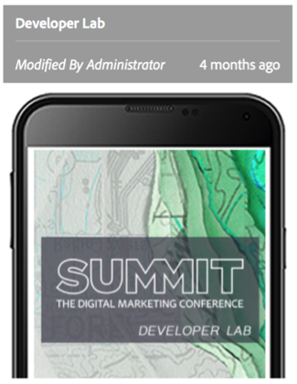

App Development
=========

Creating a new PhoneGap Enterprise App starts with a well-defined project structure that not only simplifies installation to AEM but also enables web developers to continue using the same tools they are familiar with. 

Components are an integral part to the AEM authoring experience.  They are the building blocks that developers provide to authors for assembling mobile app pages. 

## Lesson 1 – Project Structure

### Exercise 1: Project Overview

The project used by this lab includes a folder structure for developing a typical AEM application and installing resources to the server. This allows the developer to work with the tools they are accustomed to yet still provide a simple means to deploy changes to AEM through packages.

1.  Open lab project in Finder
  a.  cd summit-developer-lab
  b.  open .
2.  Go to  /content/src/main/content/jcr_root 
3.  Explore the directory structure that will be installed to AEM
  a.  /apps: location for components and templates used by app
  b.  /etc/designs: the design used by the app (ie. Styles)
  c.  /content/dam: assets used by the app (ie. Images)
  d.  /content/phonegap: all of the page content for the app
4.  What component does the page template for the app use?
5.  What clientlibs is the app’s design dependent on?

## Lesson 2 – Component Development

### Exercise 1 – Create Camera Component
1.  Copy [phonegap-camera](phonegap-camera) to [/content/src/main/content/jcr_root/apps/summit-developer-lab/components](/content/src/main/content/jcr_root/apps/summit-developer-lab/components)
2.  Open SublimeText editor
3.  Select Project > Open Project… menu
4.  Go to ~/L712/summit-developer-lab and select summit-developer-lab.sublime-project
5.  Open `.config.xml` of the phonegap-camera component and give your new component a title and description
6.  Notice the group this component belongs to

### Exercise 2 – Add JavaScript to Camera Component
1.  Open clientlibs/phonegap-camera.js in SublimeText
2.  Add JavaScript that will be used by the camera component

```
    ;(function (angular, document, undefined) {

        angular.module('phonegapCamera', ['btford.phonegap.ready'])

            .controller('CameraCtrl', ['$scope', 'camera', function($scope, camera) {

                function gotPicture(imageData) {
                    $scope.imageSrc = "data:image/jpeg;base64," + imageData;
                }

                function cameraError(message) {
                    console.error('Problem: ' + message);
                }

                $scope.takeAPicture = function() {
                    camera.getPicture(gotPicture, cameraError, {
                        quality: 50,
                        destinationType: Camera.DestinationType.DATA_URL
                    });
                };

                $scope.browseForAPicture = function() {
                    camera.getPicture(gotPicture, cameraError, {
                        quality: 50,
                        sourceType: Camera.PictureSourceType.PHOTOLIBRARY,
                        destinationType: Camera.DestinationType.DATA_URL
                    });
                };

            }])

            .factory('camera', function ($rootScope, phonegapReady) {
                return {
                  getPicture: phonegapReady(function (onSuccess, onError, options) {
                    navigator.camera.getPicture(function () {
                      var that = this,
                        args = arguments;
                        
                      if (onSuccess) {
                        $rootScope.$apply(function () {
                          onSuccess.apply(that, args);
                        });
                      }
                    }, function () {
                      var that = this,
                      args = arguments;
                        
                      if (onError) {
                        $rootScope.$apply(function () {
                          onError.apply(that, args);
                        });
                      }
                    },
                    options);
                  })
                }
            })

            ;

    }(angular, document));
```
3. Add `phonegapCamera` module to [/content/src/main/content/jcr_root/apps/summit-developer-lab/components/ng-phonegap-page/angular-module-list.js.jsp](/content/src/main/content/jcr_root/apps/summit-developer-lab/components/ng-phonegap-page/angular-module-list.js.jsp)

### Exercise 3 – Add HTML to Camera Component
1.  Open phonegap-camera.jsp in SublimeText
2.  Add HTML that will be used when the camera component is rendered

```
    <%@include file="/libs/foundation/global.jsp" %><%
    %><%@ page session="false" %><%
    %>
    <div ng-controller="CameraCtrl" class="list card">
        <div class="item">
            <h2>Camera</h2>
            <p>Take a picture</p>
        </div>
        
        <div class="item item-image">
            
        </div>
        
        <div class="item tabs tabs-secondary tabs-icon-left">
            <a class="tab-item" ng-click="takeAPicture()">
                <i class="icon ion-ios7-camera-outline"></i>
                Take a picture
            </a>
            <a class="tab-item" ng-click="browseForAPicture()">
                <i class="icon ion-ios7-photos-outline"></i>
                Browse gallery
            </a>
        </div>
    </div>
```

## Lesson 3 – Project Installation

This project uses Maven for building and contains helpful profiles and properties to build and deploy your project to AEM.



### Exercise 1 – Installing a Project to AEM
1.  Go to root folder of the lab project 
  a.  Open Terminal
  b.  cd `~/lab712/summit-developer-lab`
2.  Run `mvn -PautoInstallPackage clean install` to build the content package and install to an AEM instance
3.  In a browser navigate to [http://localhost:4502](http://localhost:4502)
4.  Log in to the AEM author instance using `admin:admin`
5.  Click on Apps from the left navigation rail 
6.  Locate the project you just installed and select it
7.  Explore the Apps Dashboard for the project you installed


[Next →](../module4)

