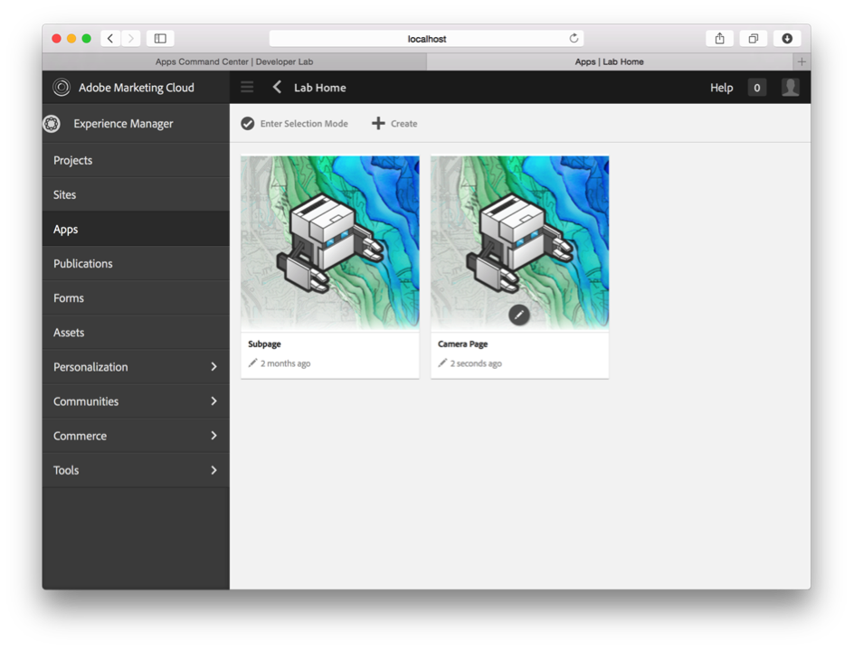

Managing App Content
=========

## Lesson 1 – AEM Authoring Basics

Adobe® Experience Manager helps you organize, create, and manage the delivery of creative assets and other content across your digital marketing channels, including web, mobile, email, communities, and video.

### Exercise 1 – Creating a page in AEM
1.	Go to the Developer Lab App command center on the [author instance](http://localhost:4502/libs/mobileapps/admin/content/dashboard.html/content/phonegap/summit-developer-lab/shell)
  1.	Click on “Apps”
  2.	Click on “Developer Lab”
  3.	Click on “English” from Content Tile
2.	Click on “Lab Home” to drill down to child pages
3.	Create a new page by selecting “Create” from the top menu, then “Create Page” 
4. Select the “PhoneGap Page” template and click on “Next” 
5. Enter a title for your page and click on “Create” 
6. Click on “Open Page” to begin editing your page (or click “Done” then click on “Open” on the page preview icon)

### Exercise 2 - Edit a page in AEM
1. Edit the page from the previous exercise by moving mouse over card to expose the edit icon and click the edit icon 
2. Add text component:
  1. Toggle the side panel open by clicking on the 3 vertical dots icon.  
  2. Select the Components tab
  3. Scroll through the list of components until you find the text component, then drag it onto the page. Tip: you can filter to the component you want by typing “text” in the filter, for example.
  4. Add some content by clicking slowly twice in the “Text” component box and start typing. 
3. Add image component:
  1. Scroll through the list until you find the image component, then drag it onto the page.
  2. Select the Assets tab
  3. Scroll through the list of assets until you find an image you like, then drag it onto the image component added earlier
  4. Crop the image
    1. Select the image  
    2. Click the edit icon Click the crop icon  
    3. Crop the image
    4. Click the check box  to close the crop
    5. Click the check box to close the image edit
4. Add camera component
  1.	Add the camera component you developed in the previous module 
5. Test the page in Preview mode by clicking on the preview icon.
6. Close the browser tab to return to the Command Center

[Next →](../module5)
