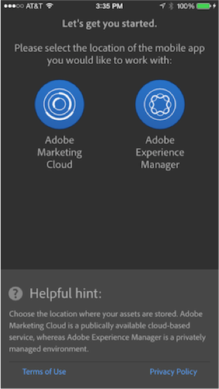

Reviewing App Content
=========

## Lesson 1 – PhoneGap CLI

AEM Apps provides the ability to download a fully rendered app payload that contains the correct directory structure and required content for building a mobile app using the PhoneGap command line interface introduced in Module 2. 

### Exercise 1 – Download CLI Assets 
1.	Click Download CLI from PhoneGap Build tiles action menu 
2.	Click Download and keep the default selection Development 
3.	A zip file of the app should have been downloaded. 
4.	Open Finder to the Downloads folder to confirm the file was downloaded

### Exercise 2 – Building via PhoneGap CLI
1.	Double click the downloaded zip to extract it to file system
2.	Open Terminal
3.	In the Terminal, run the app after changing to the app directory:
  `cd ~/Downloads/developer-lab*; phonegap run ios`

## Lesson 2 – PhoneGap Enterprise Viewer

The PhoneGap Enterprise viewer provides the ability for both developers and marketers to easily review their mobile enterprise apps. The tight integration with Adobe Experience Manager also allows for all of an app’s metadata to be viewed. The result is a fast and easy way for PhoneGap Enterprise apps to be tested and used by others at any given stage of development across multiple devices.

### Exercise 1 – Launch Viewer
In this exercise, the instructor will walk you through the key parts of the PhoneGap Enterprise viewer during a live demo of this exciting functionality. 

1. Download PhoneGap Enterprise app from app store
2. Launch PhoneGap Enterprise app
3. Connect to your local AEM instance
4. View list of apps
5. Select app from Development list
6. View meta data for app
7. Select Open to download and deploy app to your device
8. Tap the device’s screen with three fingers to return back to the PhoneGap Enterprise app list

### Exercise 2 – Refreshing an App
In this exercise, the instructor will continue walking you through the PhoneGap Enterprise viewer after making changes to the app’s page content and meta data in AEM.

1. Pull down on the development tab to refresh the app list
2. Open the specified app again
3. Notice the meta data has been updated
4. Tap on Open again to download and deploy the app
5. Notice the page content in the app has also changed 

### Exercise 3 – Staging an App
In this exercise the instructor will stage the updated content for publishing in AEM.

1. Return to the app list using the three finger tap gesture
2. Select the Staging tab
  a. Notice the app also appears on this tab since content has now been staged (you may need to pull down the list to refresh)

[Next →](../module6)